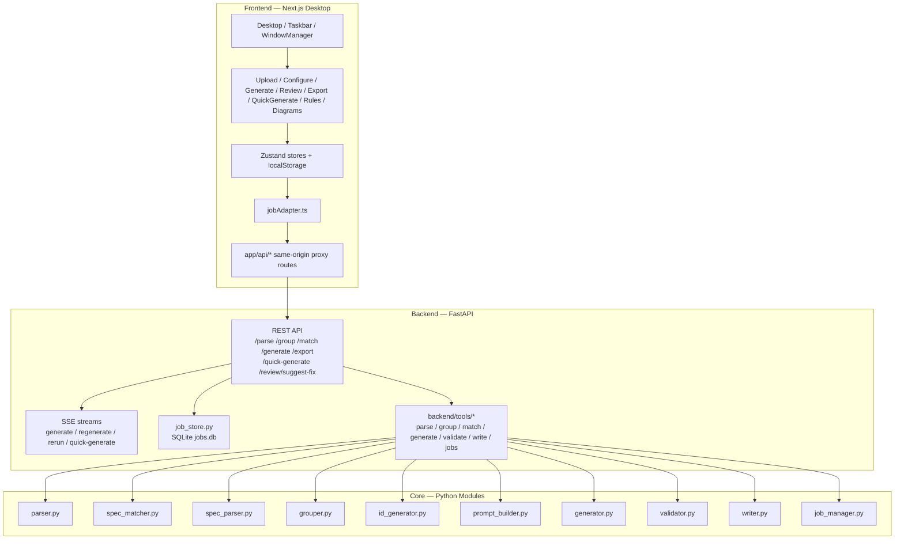

# TC Generator — 專案狀態

## Recent changes (2026-07-15)

- **AI instruction 規則擴充**：從一份 feature-agnostic 通則吸收三段新規則進權威
  文件 `docs/runtime/ASPICE_SWE6_AI_Instruction.md`（auto-load 進 generate / review /
  gen_bridge prompt）：
  - **§8.6 Spec Reference Hierarchy**：原始 spec 來源優先於追溯 index 匯出；
    不因需求未出現在 index 就撤回，先查原始 spec。
  - **§8.7 Cross-Domain Behavioral Patterns**：spec-sourced threshold 用具體值、
    區分語意相近操作(cancel/stop)、variant label 一致套用、greyed-out ≠ 不可操作。
  - **§8.2.2** 補「同/不同控制實體」的拆併條件；**§9 Self-Check** 新增第 17 項。
  - 其餘章節與現有文件重疊未動；文件維護 meta 慣例未併入 prompt。
- **文件去 emoji**：文件、產物報告與其產生器(`scorecard.py` / `main.py`)移除彩色
  emoji，保留箭頭 / 圈號 / 單色標記。

## Recent changes (2026-06-30)

Backend pipeline 改造為「接地 + KPI 量測」的閉環管線，全部在
`feat/m1-stage7-scorecard` 分支，**尚未 merge 進 `main`**。Backend 測試基線
**618 tests collected**。詳見 [`M1/PROGRESS.md`](../M1/PROGRESS.md)。

- **M0/M0b — Provider 抽象**：新增 `backend/providers/`（OpenAI + Anthropic +
  budget + factory）與 `set_provider` seam；`generator._chat` 全走 provider
  層，透過 `TC_LLM_BACKEND` env 切換後端（`anthropic` 需 `ANTHROPIC_API_KEY`）。
- **M1 — Stage 7 KPI Scorecard**：`backend/scorecard.py` + `config/kpi_thresholds.json`，
  純 Python、零花費；`--scorecard --findings <path>` 從既有 `findings.json`
  算 7+1 KPI（含 `tier1_critical_req_rate`、L2 `spec_coverage`）。
- **M2 — Budget planner**：`backend/budget_planner.py`，`--preflight` 估算花費/
  時間、`--calibrate` 由 probe run 推導 throughput。
- **Stage 1 — Domain grounding**：`backend/domain_pack.py`；Player pack 由 SWE1
  分析重建（`M1/domain_pack_player.json`）。實測拆解誤報 55.6% → 22.2%。
- **Stage 3 — Deep decompose**：單需求拆解注入 domain pack（PLA-030 Repeat
  覆蓋 ~3 → 11 情境、0 幻覺）。
- **Stage 6 — Grounded review**：review 注入 domain + §7.6 reality-gap 規則
  （`--domain-pack`）；對真矛盾 TC 觸發、對乾淨 TC 靜默。
- **Content traceability**：`backend/req_tracer.py` + `--trace` CLI，基於內容
  比對而非固定 id；新增 req_id_mismatch KPI（Dealer / Player 資料驗證）。
- **Closed-loop generation**：SPEC-grounded 生成橋接（互動、$0）把 TC 寫入
  team template 並套用 house rules，再匯出可再審查的 `.xlsx`，形成
  生成 → 審查 → 匯出 的閉環（`--gen-export-bundle` / `--gen-assemble` /
  `--gen-template`）。
- **Interactive review SOP**：語意 review 層可在 subscription 上跑（$0），
  `--export-bundle` / `--assemble`；`review_workbook(..., domain_pack_path=...)`
  主路徑可用。

## Recent changes (2026-05-18)

- **Modern UI variant**：新增獨立 `frontend-modern/` Next.js package，不取代
  既有 `frontend/` Win95 desktop；包含 same-origin proxy routes、Zustand
  stores、module UI、Vitest unit tests、Playwright E2E specs、Dockerfile 與
  `frontend-modern/README.md`。
- **Separate runtime ports**：modern local launcher 使用 frontend `3433`、
  backend `8013`；`./start-modern.sh` 會讀取 repo root `.env`、同步
  `frontend-modern/.env.local`，並同時啟動 backend reload 與 modern
  Next.js dev server。
- **Modern Docker profiles**：新增 `docker/docker-compose.modern.dev.yml` 與
  `docker/docker-compose.modern.yml`，container / image / compose project 均以
  modern 命名隔離；modern backend runtime output 寫入 `output-modern/`。
- **ASPICE wording rules**：`ASPICE_SWE6_AI_Instruction.md` 補強 UI label
  必須使用 double quotes、baseline wording、one trigger 多 consequential
  outcomes 不拆 TC 等規則。
- **Refinement helper**：新增 `refinement/retry_failed.py`，針對 lint_failed
  TC 用較強 retry prompt 重跑並要求 step / ER 1:1。
- **Verification**：modern frontend `npm run typecheck` 通過；
  `npm run test:unit` 為 20 files / 134 tests pass。

## Recent changes (2026-05-02)

ASPICE SWE.6 Review feature：與既有 Generate path 並行，**不取代**任何
現有功能。

- **Review spec & rules table**：`docs/runtime/ASPICE_SWE6_AI_Review.md`（v2.2）
  + `backend/rules/review_rules.yaml` 雙檔案，前者 auto-load 進 review
  prompt（mirrors `ASPICE_SWE6_AI_Instruction.md`），後者是 31 條規則的
  機器可讀表（20 條 `requires_llm: false`、11 條需 LLM）。
- **Backend pipeline**：`backend/review_engine.py` 完整實作 §5 Workflow ——
  parse → group by Req ID → Tier 1（§6.x）→ Tier 2（§7.x，跳過 tier1_skipped
  的 group）→ Tier 3（§8.x，永遠跑）→ apply mutual exclusions
  （§7.4 ⊕ §8.3.6）+ suppressions（§6.4 → §8.1.4）→ enforce severity
  ceilings（Tier 3 attempt to emit Critical 拋 `ReviewEngineError`）→
  emit §9 schema findings。`review_prompt_builder.py` 鏡像
  `prompt_builder.py` 樣式、批次餵 LLM 規則。
- **CLI**：`python backend/main.py --review --input X.xlsx --output-dir
  output [--dry-run]` 產 `findings.json` + `findings_report.md`。誤
  混 generate-only flags（`--mode` / `--batch-size` / `--sys1` 等）
  以 exit 2 拒絕。
- **API**：`POST /api/audit`（multipart workbook upload，回 §9 JSON），
  Next.js proxy `frontend/app/api/audit/route.ts`。
- **Frontend**：`AuditModule.tsx`（self-contained：upload → run → batch
  summary + Per Req / Per TC tabs + severity 篩選 + JSON 下載）。命名
  避開既有的 `ReviewModule.tsx`（per-TC validation），endpoint 用
  `/api/audit` 避開既有 `/api/review/suggest-fix`。
- **測試**：`tests/test_review_engine.py`（20 個，4 個 deep-dive
  cases、mutual exclusion、suppression、ceiling enforcement、dry-run、
  schema invariants）+ `tests/test_main.py` review CLI 5 個 +
  `tests/test_api_server.py` audit endpoint 2 個。全 backend 528
  tests pass。
- **依賴**：新增 `pyyaml`（rule table 解析）。

## Recent changes (2026-04-27 ~ 2026-04-28)

Review / Generate UX 系列升級，發生在 agent 移除之後：

- **Review fix suggestion**：新增窄場景 `POST /api/review/suggest-fix`
  端點（`backend/review_assistant.py`），ValidationPanel 在 row 有
  validation error 時提供 AI 結構化修法建議
  （`problem_root_cause` / `affected_fields` / `proposed_change` /
  `suggested_reason` 四欄分區顯示），取代被移除的通用 chat co-pilot。
- **Regenerate dialog**：底部 toolbox 拿掉常駐 reason 輸入框；改成按
  Regenerate 按鈕後才跳出 Win95Dialog 填 reason，避免使用者在不知情
  下觸發 AI。ValidationPanel 套用過的 reason 會 pre-fill 進該 dialog。
- **Re-run completion summary**：Re-run 結束顯示 Win95Dialog 摘要
  （rowsUpdated / rowsAdded / rowsFailed），不再只在 log panel 印
  一行小字。
- **Sibling-aware generation**：Parse 時偵測同 Requirement ID 多列
  並把彼此 test_item 注入 prompt，AI 必須回兩個結構化欄位 ——
  `duplicate_of`（嚴格判定等價的 row 編號）+ `distinguishing_axis`
  （`{axis ∈ trigger_state | input_data | timing | boundary | mode |
  none, delta}`）。Backend 對兩者做 cross-validation；前端
  `splitDecision` 分別顯示「⊕ 重複於 row #N」紅卡與「與 sibling
  差異」灰卡，TC ID 欄位另加 `⊕ DUP→N` chip 讓 collapsed view 也看得到。
- **Test Set 分類 per-row**：`classify_test_sets` 改用 row uuid 為唯一
  key（不再 dedup 到 req_id），同 Requirement ID 多列各自獲得 Test
  Set；deterministic fallback 從 `REQ <prefix>` 改成 `Unclassified`
  讓「分類失敗」更顯眼。
- **Export TC ID 重編**：Export 前 `_resequence_export_tc_ids` 把每個
  `(project, group_abbr)` bucket 重新 001/002/003 編號，閉合 reviewer
  刪除留下的空隙；response 多 `tcIdsRenumbered` 欄位回報數量。
- **Generate progress**：`stats.total` 改以原始 Requirement ID 計算
  並鎖定，AI 拆分不會把分母往上推；UI 也從「TCs」改成「requirements」。
- **Generate stream resume**：SSE 斷線不再直接 dead-end；GenerateModule
  捕捉 disconnect 訊息後顯示 Resume / Discard banner，Resume 用尚未
  完成的 row id 重發 startGeneration。
- **Sibling badge**：duplicate-of 徽章從只在 expanded panel 顯示，
  改為 collapsed table 也帶一個短 chip。
- **Workflow mechanism cleanup**：Configure 的 grouping preview 在
  `Start Generate` 時會自動 apply；Generate / Regenerate 移除 local
  mock fallback，缺 active backend job 直接報錯；usage base 改由
  `*.started` event 明確帶出，history 記 delta，backend 每個成功 batch
  立即 persist usage；Quick Generate Stop 透過 AbortController → Next proxy
  signal → backend disconnect check 停止後續 SSE success events。

之後增加新功能會繼續追加在此段。

最後更新：2026-04-27（active GUI workflow 與 usage/cancel 機制已對齊目前實作；
Agent 相關內容保留為歷史紀錄，見 [docs/design-system/archive/MIGRATION.md](design-system/archive/MIGRATION.md)）

本次補充：
- Next.js JSON proxy routes 改為保留 upstream status/body，不再把 backend
  的非 JSON 失敗誤包成 generic `503`
- `/api/export` 未預期例外統一回 `detail: "export failed: <Type>: <message>"`
  方便前端直接顯示根因

這份文件描述**目前已完成的內容**。

目前 active 範圍：
- Backend：FastAPI REST / SSE + `backend/tools/` pure-function tool layer。
- Frontend：Upload / Configure / Generate / Review / Export / QuickGenerate / Rules / Diagrams。
- 持久化：`job_store.py` + SQLite `jobs.db`。
- 已移除：舊 Agent co-pilot、ChatModule、agent routes、trace/session store。

---

## 專案簡介

TC Generator 是一套針對 ASPICE SWE.6 的自動化測試案例產生工具，由兩部分組成：

- **Python backend / CLI**：解析、匹配、生成、驗證、Excel 回寫
- **Next.js desktop frontend**：Win95 風格桌面，提供 upload → configure → generate → review → export 流程

### 模型任務分工

- `classify_test_sets` 固定使用 `gpt-5-mini`
  因為任務相對簡單，且已有 deterministic fallback。
- `decompose_requirement`、quick generate、一般 TC generation
  使用使用者選定的 model。
- 主流程 UI 目前只提供 `gpt-5` / `gpt-5.4` 給使用者選。
- 同一任務不因 model 不同而切換 prompt，保持效果可對比。

---

## 目前架構



完整視覺化（使用者流程）：
[TC_Generator_Architecture_Diagrams.html](dev/TC_Generator_Architecture_Diagrams.html)

---

## 目錄結構

```text
TC_Generator/
├── backend/
│   ├── api_server.py                # FastAPI 整合層；啟動時執行 purge_older_than + vacuum
│   ├── parser.py                    # 解析 TC workbook（容忍中英雙語 sheet 標題、檔名日期後綴）
│   ├── spec_matcher.py              # 規格匹配（Layer 1 PDM regex + Layer 1.5 Jaccard + Layer 2 cosine semantic via cached embeddings）
│   ├── spec_parser.py               # 補充文件解析
│   ├── id_generator.py              # TC ID 生成
│   ├── grouper.py                   # Test Set grouping（fallback: existing → PDM → REQ prefix → Unassigned）
│   ├── prompt_builder.py            # Prompt 組裝，含 _HARD_CONSTRAINTS footer
│   ├── generator.py                 # OpenAI chat completions + JSON mode；hard-issue retry + MODEL_ESCALATION
│   ├── validator.py                 # 程式化驗證（design method 接受英文關鍵字）
│   ├── writer.py                    # Excel 回寫
│   ├── job_manager.py               # review/export 狀態管理
│   ├── job_store.py                 # SqliteJobStore，job 持久化到 output/jobs.db
│   ├── tools/                       # tool layer（純函式 + registry）
│   │   ├── __init__.py              # 匯出 ToolError / SafetyLevel / 各 tool
│   │   ├── errors.py                # ToolError + HTTP status 對照
│   │   ├── registry.py              # ToolSpec / SafetyLevel / register_tool
│   │   ├── schemas.py               # OpenAI function-calling JSON schemas
│   │   ├── _budget.py               # needs_confirmation() 門檻
│   │   ├── parse.py                 # parse_workbook_tool      (WRITE_SAFE)
│   │   ├── group.py                 # group_tests_tool         (WRITE_COSTLY; AI + deterministic fallback)
│   │   ├── match.py                 # match_spec_tool          (READ_ONLY)
│   │   ├── validate.py              # validate_tc_tool         (READ_ONLY)
│   │   ├── write.py                 # write_excel_tool         (DESTRUCTIVE)
│   │   ├── generate.py              # generate_tc_tool         (WRITE_COSTLY)
│   │   ├── inspect.py               # inspect_workbook_tool    (READ_ONLY)
│   │   └── jobs.py                  # list_jobs / estimate_cost / get_job_detail / diff_jobs / aggregate_metrics / get_job_validation
│   └── main.py                      # CLI 入口
├── tests/                           # pytest（目前 481 個測試；持續隨功能增補）
├── frontend/
│   ├── app/
│   │   ├── page.tsx / layout.tsx
│   │   └── api/                     # Same-origin proxy routes
│   ├── src/
│   │   ├── components/system/       # Desktop / Taskbar / WindowManager / CostMeter / CostDashboardPopup / WorkspaceMenu / JobHistoryMenu
│   │   ├── components/modules/      # Upload / Configure / Generate / Review / Export / QuickGenerate / Diagrams / Rules
│   │   ├── services/jobAdapter.ts
│   │   ├── store/                   # useJobStore (persist) / useWindowStore / useWorkspaceStore / useJobHistoryStore
│   │   └── styles/win95.css
│   ├── e2e/                         # Playwright specs
│   └── public/diagrams.html
├── output/
│   └── jobs.db                      # SQLite job registry（自動建立）
└── docs/                            # 本文件所在位置
```

---

## API 端點

HTTP / SSE 端點集中在 `backend/api_server.py`。

- `GET /api/health`
- `GET /api/spec-library`
- `DELETE /api/admin/reset`
- `GET /api/metrics/aggregate`
- `POST /api/parse`
- `POST /api/group`
- `POST /api/match`
- `POST /api/generate`
- `GET /api/generate/stream`
- `POST /api/jobs/{jobId}/regenerate/stream`
- `POST /api/jobs/{jobId}/rerun/stream`
- `POST /api/export`
- `GET /api/export/download/{jobId}`
- `POST /api/quick-generate/stream`
- `POST /api/audit`（ASPICE SWE.6 review pipeline，§9 schema findings）
完整 request / response 格式請看 [API_CONTRACT.md](dev/API_CONTRACT.md)。

---

## 已完成里程碑

### Backend

- 核心 9 模組全部實作並通過測試（parser / spec_matcher / spec_parser / grouper / prompt_builder / generator / validator / writer / job_manager）
- **Tool layer**：`backend/tools/` 封裝所有業務動作為 pure function；
  FastAPI route 變薄，僅處理 HTTP 邊界與 `ToolError → HTTPException` 翻譯；
  route 與 CLI 共用同一套核心邏輯
- `GET /api/metrics/aggregate` REST endpoint 供 Cost Dashboard UI 使用
- SqliteJobStore：job 跨重啟持久化；啟動自動 `purge_older_than` + `vacuum`（預設 30 天，`TC_JOBS_MAX_AGE_DAYS` 覆寫）
- Parser 容忍中英雙語 sheet 標題與檔名後綴（`拷貝`、`-1` 等）；Writer 的
  `_clean_basename()` 也會在 export 前剝掉 `拷貝 / 的副本 / copy / - Copy / (N)`
  這類複製殘留字尾，避免 `..._拷貝_generated.xlsx` 這種輸出檔名
- Spec matcher 命中率從 54.5% 提升到 100%（Layer 1 + Layer 1.5 fuzzy Jaccard）
- Generator：OpenAI function calling + JSON mode、auto prompt caching
- Hard-issue retry（Proc ≠ ER 計數、空欄位、priority / design_method 無效）
- `MODEL_ESCALATION`：硬性違規 retry 失敗時自動升級（`gpt-4o` → `gpt-4.1` → `gpt-5.4` → `gpt-5`；`gpt-5-mini` → `gpt-5`）
- ASPICE SWE.6 規則從 `docs/` 自動載入到 system prompt
- **禁止 AI 捏造未指定數值 / 資料**（§10a + §10b + §10.3）：若需求沒給具體數字、
  錯誤碼、timeout、dataset 名稱、狀態、識別碼等，AI 必須以 `<configured limit>`
  等 abstract 寫法保留未知，不可編造來讓 TC 看起來「完整」。Self-check 與
  WRITING DISCIPLINE 兩層都會 gate。

### Frontend

- Win95 單頁桌面 shell：Desktop / Taskbar / WindowManager / AppWindow
- Zustand stores：`useJobStore`（persist）/ `useWindowStore` / `useWorkspaceStore` / `useJobHistoryStore`
- 單一 adapter 層：`services/jobAdapter.ts`
- Same-origin Next.js proxy routes 全數可用
- 活躍 modules：Upload / Configure / Generate / Review / Export / QuickGenerate / **Audit**（ASPICE SWE.6 三層審核，self-contained module，未掛入 desktop window manager）
- CostMeter：Model / Input / Output / Cache W / Cache R / Hit-rate；
  標題列新增 bar-chart 小按鈕開啟 `CostDashboardPopup`（讀
  `/api/metrics/aggregate` 顯示跨 job 總 / 平均 cost 與 spec match rate）
- Workspace Manager：save / rename / load / delete / JSON import / JSON export（localStorage 持久化）
- Job History menu：lifetime cumulative cost + per-job record（localStorage，TTL 90 天 + MAX_RECORDS cap）
- Review：batch accept/reject/delete；Regenerate 可輸入 reviewer reason，AI 以
  `regenerateReason` 修正並重新判斷是否拆解；Re-run 重走完整 pipeline。兩者
  都會透過 `req.split.insertPlan` 回報新增列數 / 插入錨點 / 是否重排，前端再
  以 `row.added` 插入 sub-TC rows；word-level diff；spec reference 自動顯示
- Configure：grouping + matching preview + 手動 `testSet` override
- 成本統計：同一 job 的 grouping / generate / regenerate / rerun usage 都累加到同一份 session stats；
  started event 帶 base usage，前端 history 記 delta；後端每個成功 batch 立即 persist usage。
- Design system：`components/ui/` primitive 層（`Button` / `IconButton` / `StatusBadge`
  + barrel export），`win95.css` token 化（`--status-*` / `--win95-*`）；
  全部 GUI modules 統一使用 primitives；`ReviewModule.tsx` 從 800 行拆為
  orchestrator + 7 個聚焦子元件 + 1 個純函式 diff 模組；Taskbar 修正：
  隱藏 window-tabs 橫向 scrollbar 避免浮出 28px taskbar、時鐘改 Win95 經典
  HH:MM（完整日期丟 tooltip）、覆蓋 98.css `.status-bar-field` 的
  `flex-grow: 1` 讓時鐘貼齊內容不再吞掉 tabs 的寬度
- Design system migration（對照 [docs/design-system/MIGRATION.md](design-system/MIGRATION.md)）：
  - **Phase 1–7 全部完成**（tokens + global rules + 顏色清查 + motion cleanup +
    Desktop/Taskbar/AppWindow 視覺對齊 + 8 modules 視覺對齊 + iconography）
  - Phase 8 測試 & 驗收：unit tests 126/126 pass；E2E + 完整手動驗收待跑
  - Post-migration polish backlog（§P1–§P13）：**10 項完成 + 1 deferred + 2 removed/unused**
    - P1 ValidationPanel resizable splitter、P2 cost budget threshold warning、
      P3 `pendingRegenerated` → `awaitingApply`、P4/P12 expanded vs selected
      state 拆分、P5 誤報關閉、P6 `Win95Dialog` 通用元件、P9 inline sunken
      refactor (3/4, RegenDiff 條件式 pattern 為永久例外)、P10 ReviewToolbar
      改 raised bezel、P13 Rules tabpanel 移除 nested sunken
    - P7 Typography Tailwind → semantic class deferred（機械 refactor 會撞到
      font-weight/line-height 其他 modifier，per-module opportunistic migration）
  - 相關系統性 fix：sunken-bezel token 語意修正（`--win95-gray-mid` → `--win95-gray-dark`
    跨 42 處產品程式碼 + design bundle），掃出 TSX inline 重寫 canonical pattern
    的 bad pattern (§P9)
- Icon 可見度修復：98.css 把 `button { color: transparent }` 再用
  text-shadow 假造文字色，導致 Remix Icon 的 `fill=currentColor` 全透明
  → `win95.css` 加上 `button { color: #222 }` 統一蓋回；並用
  `button svg.remixicon { image-rendering: auto }` 解除 pixelated
  rendering 讓線條 icon 恢復抗鋸齒

### Runtime 基準（真實檔案壓力測試）

| 指標 | 值 |
|---|---|
| Rows | 44 |
| 成本 | $0.125 |
| 耗時 | 251s |
| Cache hit | 90.9% |
| 1:1 violations | 2.3%（1/44）|
| 模型 | GPT-5.4 mini + retry + escalation |

### 測試覆蓋

- `pytest -q`：481 pass
- `npm run typecheck` (`tsc --noEmit`)：0 error
- `npm run test:unit` (Vitest)：128 pass（UI primitives / active modules /
  jobAdapter / stores / diffTokens / ReviewRow）
- Playwright E2E：Workspace JSON round-trip（save → export → new → import → load）
- API smoke：parse / group / match / generate / regenerate / export / download 端到端

---

## 環境與依賴

| 項目 | 需求 |
|---|---|
| Python | `>= 3.10` |
| Node.js | `>= 20` |
| `OPENAI_API_KEY` | 必要（真實生成） |
| SQLite | 內建於 Python，無需另外安裝 |
| `TC_JOBS_DB` | 選填，覆寫 jobs.db 路徑 |
| `TC_JOBS_MAX_AGE_DAYS` | 選填，預設 30 天 |
| `TC_CORS_ORIGINS` | 選填，逗號分隔 |
| `TC_MAX_UPLOAD_MB` | 選填，預設 50MB |

---

## 檔案對照

| 用途 | 檔案 |
|---|---|
| 設定 + 執行指令 | [../README.md](../README.md) |
| 使用機制總表（指令 / API / AI / 狀態） | [WORKFLOW_MECHANISM_TABLE.md](dev/WORKFLOW_MECHANISM_TABLE.md) |
| API 合約 | [API_CONTRACT.md](dev/API_CONTRACT.md) |
| ASPICE SWE.6 Generate 規則（LLM prompt 用） | [ASPICE_SWE6_AI_Instruction.md](ASPICE_SWE6_AI_Instruction.md) |
| Test Set 分類 / hint / export policy | [TEST_SET_POLICY.md](TEST_SET_POLICY.md) |
| ASPICE SWE.6 Review 規則（LLM prompt 用） | [ASPICE_SWE6_AI_Review.md](ASPICE_SWE6_AI_Review.md) |
| Test Design Method 判斷（LLM prompt 用） | [TEST_CASE_DESIGN_METHOD.md](TEST_CASE_DESIGN_METHOD.md) |
| Test Case Priority 定義 | [TEST_CASE_PRIORITY.md](TEST_CASE_PRIORITY.md) |
| 架構視覺化 | [TC_Generator_Architecture_Diagrams.html](dev/TC_Generator_Architecture_Diagrams.html) |

> Generate 規則由 `backend/rules_loader.py` 載入；改名或搬移 runtime 規則文件時，需同步更新 loader 與相關測試。
