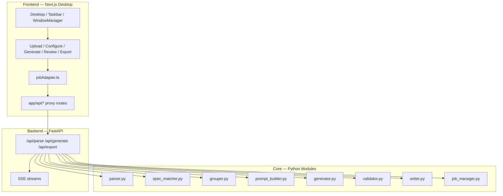

# TC Generator — 專案狀態

最後更新：2026-04-18

這份文件描述**目前已完成的內容**。下一步規劃請看 [ROADMAP.md](ROADMAP.md)。

---

## 專案簡介

TC Generator 是一套針對 ASPICE SWE.6 的自動化測試案例產生工具，由兩部分組成：

- **Python backend / CLI**：解析、匹配、生成、驗證、Excel 回寫
- **Next.js desktop frontend**：Win95 風格桌面，提供 upload → configure → generate → review → export 流程

---

## 目前架構



完整視覺化：[TC_Generator_Architecture_Diagrams.html](TC_Generator_Architecture_Diagrams.html)

---

## 目錄結構

```text
TC_Generator/
├── backend/
│   ├── api_server.py                # FastAPI 整合層；啟動時執行 purge_older_than + vacuum
│   ├── parser.py                    # 解析 TC workbook（容忍中英雙語 sheet 標題、檔名日期後綴）
│   ├── spec_matcher.py              # 規格匹配（Layer 1 PDM regex + Layer 1.5 token Jaccard fuzzy）
│   ├── spec_parser.py               # 補充文件解析
│   ├── id_generator.py              # TC ID 生成
│   ├── grouper.py                   # Test Set grouping（fallback: existing → PDM → REQ prefix → Unassigned）
│   ├── prompt_builder.py            # Prompt 組裝，含 _HARD_CONSTRAINTS footer
│   ├── generator.py                 # OpenAI chat completions + JSON mode；hard-issue retry + MODEL_ESCALATION
│   ├── validator.py                 # 程式化驗證（design method 接受英文關鍵字）
│   ├── writer.py                    # Excel 回寫
│   ├── job_manager.py               # review/export 狀態管理
│   ├── job_store.py                 # SqliteJobStore，job 持久化到 output/jobs.db
│   └── main.py                      # CLI 入口
├── tests/                           # pytest（225 pass）
├── frontend/
│   ├── app/
│   │   ├── page.tsx / layout.tsx
│   │   └── api/                     # Same-origin proxy routes
│   ├── src/
│   │   ├── components/system/       # Desktop / Taskbar / WindowManager / CostMeter / WorkspaceMenu / JobHistoryMenu
│   │   ├── components/modules/      # Upload / Configure / Generate / Review / Export / QuickGenerate / Diagrams / Rules
│   │   ├── services/jobAdapter.ts
│   │   ├── store/                   # useJobStore (persist) / useWindowStore / useWorkspaceStore / useJobHistoryStore
│   │   └── styles/win95.css
│   ├── e2e/                         # Playwright specs
│   └── public/diagrams.html
├── output/
│   └── jobs.db                      # SQLite job registry（自動建立）
└── docs/                            # 本文件所在位置
```

---

## API 端點

全數於 `backend/api_server.py`：

- `GET /api/health`
- `POST /api/parse`
- `POST /api/group`
- `POST /api/match`
- `POST /api/generate`
- `GET /api/generate/stream`
- `POST /api/jobs/{jobId}/regenerate/stream`
- `POST /api/export`
- `GET /api/export/download/{jobId}`
- `POST /api/quick-generate/stream`

完整 request / response 格式請看 [API_CONTRACT.md](API_CONTRACT.md)。

---

## 已完成里程碑

### Backend

- 核心 9 模組全部實作並通過測試（parser / spec_matcher / spec_parser / grouper / prompt_builder / generator / validator / writer / job_manager）
- SqliteJobStore：job 跨重啟持久化；啟動自動 `purge_older_than` + `vacuum`（預設 30 天，`TC_JOBS_MAX_AGE_DAYS` 覆寫）
- Parser 容忍中英雙語 sheet 標題與檔名後綴（`拷貝`、`-1` 等）
- Spec matcher 命中率從 54.5% 提升到 100%（Layer 1 + Layer 1.5 fuzzy Jaccard）
- Generator：OpenAI function calling + JSON mode、auto prompt caching
- Hard-issue retry（Proc ≠ ER 計數、空欄位、priority / design_method 無效）
- `MODEL_ESCALATION`：自動在 `gpt-4.1-mini` → `gpt-4.1` → `gpt-5` 之間升級
- ASPICE SWE.6 規則從 `docs/` 自動載入到 system prompt

### Frontend

- Win95 單頁桌面 shell：Desktop / Taskbar / WindowManager / AppWindow
- Zustand stores：`useJobStore`（persist）/ `useWindowStore` / `useWorkspaceStore` / `useJobHistoryStore`
- 單一 adapter 層：`services/jobAdapter.ts`
- Same-origin Next.js proxy routes 全數可用
- 活躍 modules：Upload / Configure / Generate / Review / Export / QuickGenerate
- CostMeter：Model / Input / Output / Cache W / Cache R / Hit-rate
- Workspace Manager：save / rename / load / delete / JSON import / JSON export（localStorage 持久化）
- Job History menu：lifetime cumulative cost + per-job record（localStorage，TTL 90 天 + MAX_RECORDS cap）
- Review：batch accept/reject/delete/regenerate；word-level diff；spec reference 自動顯示
- Configure：grouping + matching preview + 手動 `testSet` override

### Runtime 基準（真實檔案壓力測試）

| 指標 | 值 |
|---|---|
| Rows | 44 |
| 成本 | $0.125 |
| 耗時 | 251s |
| Cache hit | 90.9% |
| 1:1 violations | 2.3%（1/44）|
| 模型 | GPT-4.1-mini + retry + escalation |

### 測試覆蓋

- `pytest -q`：225 pass
- `npx tsc --noEmit`：0 error
- Playwright E2E：Workspace JSON round-trip（save → export → new → import → load）
- API smoke：parse / group / match / generate / regenerate / export / download 端到端

---

## 環境與依賴

| 項目 | 需求 |
|---|---|
| Python | `>= 3.10` |
| Node.js | `>= 20` |
| `OPENAI_API_KEY` | 必要（真實生成） |
| SQLite | 內建於 Python，無需另外安裝 |
| `TC_JOBS_DB` | 選填，覆寫 jobs.db 路徑 |
| `TC_JOBS_MAX_AGE_DAYS` | 選填，預設 30 天 |
| `TC_CORS_ORIGINS` | 選填，逗號分隔 |
| `TC_MAX_UPLOAD_MB` | 選填，預設 50MB |

---

## 檔案對照

| 用途 | 檔案 |
|---|---|
| 設定 + 執行指令 | [../README.md](../README.md) |
| **下一步規劃** | **[ROADMAP.md](ROADMAP.md)** |
| API 合約 | [API_CONTRACT.md](API_CONTRACT.md) |
| TC 生成規則（工具實作用） | [RULES.md](RULES.md) |
| ASPICE SWE.6 規則（LLM prompt 用） | [ASPICE_SWE6_Test_Case_Writing_Rules.md](ASPICE_SWE6_Test_Case_Writing_Rules.md) |
| Test Design Method 判斷（LLM prompt 用） | [Test Case Design Method 判斷規則.md](Test%20Case%20Design%20Method%20判斷規則.md) |
| 架構視覺化 | [TC_Generator_Architecture_Diagrams.html](TC_Generator_Architecture_Diagrams.html) |

> `RULES.md`、`ASPICE_SWE6_Test_Case_Writing_Rules.md`、`Test Case Design Method 判斷規則.md` 的檔名被 `backend/api_server.py` 硬寫死，改名會導致規則載入失敗。
