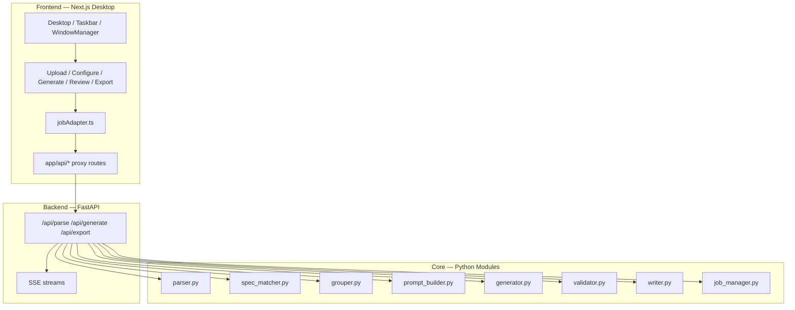

# TC Generator — 專案狀態

最後更新：2026-04-19（Phase 4 功能面完成：get_job_detail / state_update SSE
/ AgentStateUpdateToast / diff_jobs / aggregate_metrics / Cost Dashboard UI；
+ Taskbar polish + ReviewRow tests + 按鈕 icon 透明度修復；
+ Design system migration Phase 1–7 全部完成 + Phase 8 unit tests 126/126 pass
+ Post-migration polish 10 項完成（剩 P7 deferred），見
[docs/design-system/MIGRATION.md](design-system/MIGRATION.md)）

這份文件描述**目前已完成的內容**。下一步規劃請看 [ROADMAP.md](ROADMAP.md)。

> **Phase 0 + Phase 1 + Phase 2 + Phase 3 已完成**：
> - Phase 0：`backend/tools/` 下建立 10 個 pure-function tool。
> - Phase 1：`agent_dispatcher.py` + SSE endpoint + session / trace store。
> - Phase 2：Frontend ChatModule（`useAgentStore` / `agentClient` / SSE parsing /
>   ToolCallCard / ConfirmCard / MessageList / InspectorPanel / InputArea /
>   AgentTaskbarButton）+ 煙霧測試 + 4 個 backend bug 修正。
> - Phase 3：`HelpFromAgentButton` 加入 5 個 GUI module；`agent-prefill`
>   CustomEvent handoff 機制；handoff E2E。
> - Phase 4（進行中）：`get_job_detail` ✓；`state_update` SSE event ✓
>   （`useAgentStore.lastStateUpdate` → `AgentStateUpdateToast`）；
>   `diff_jobs` ✓；`aggregate_metrics` ✓（跨 job 總 / 平均 rowCount / cost、
>   matchRate）；Cost Dashboard UI ✓（`/api/metrics/aggregate` REST +
>   `CostDashboardPopup`，從 CostMeter 標題列小按鈕開啟）。
>
> 下一步：Phase 4 進階項（排程執行，與 scheduled-tasks MCP 整合）。

---

## 專案簡介

TC Generator 是一套針對 ASPICE SWE.6 的自動化測試案例產生工具，由兩部分組成：

- **Python backend / CLI**：解析、匹配、生成、驗證、Excel 回寫
- **Next.js desktop frontend**：Win95 風格桌面，提供 upload → configure → generate → review → export 流程

---

## 目前架構



完整視覺化：[TC_Generator_Architecture_Diagrams.html](TC_Generator_Architecture_Diagrams.html)

---

## 目錄結構

```text
TC_Generator/
├── backend/
│   ├── api_server.py                # FastAPI 整合層；啟動時執行 purge_older_than + vacuum
│   ├── parser.py                    # 解析 TC workbook（容忍中英雙語 sheet 標題、檔名日期後綴）
│   ├── spec_matcher.py              # 規格匹配（Layer 1 PDM regex + Layer 1.5 token Jaccard fuzzy）
│   ├── spec_parser.py               # 補充文件解析
│   ├── id_generator.py              # TC ID 生成
│   ├── grouper.py                   # Test Set grouping（fallback: existing → PDM → REQ prefix → Unassigned）
│   ├── prompt_builder.py            # Prompt 組裝，含 _HARD_CONSTRAINTS footer
│   ├── generator.py                 # OpenAI chat completions + JSON mode；hard-issue retry + MODEL_ESCALATION
│   ├── validator.py                 # 程式化驗證（design method 接受英文關鍵字）
│   ├── writer.py                    # Excel 回寫
│   ├── job_manager.py               # review/export 狀態管理
│   ├── job_store.py                 # SqliteJobStore，job 持久化到 output/jobs.db
│   ├── trace_store.py               # SqliteTraceStore（agent 決策歷程，sha256 hash）
│   ├── agent_session_store.py       # SqliteAgentSessionStore（對話 history）
│   ├── agent_dispatcher.py          # LLM loop + tool 分發 + budget gate
│   ├── routes/
│   │   ├── __init__.py
│   │   └── agent.py                 # /api/agent/chat SSE + session REST
│   ├── tools/                       # Phase 0 tool layer（純函式 + registry）
│   │   ├── __init__.py              # 匯出 ToolError / SafetyLevel / 各 tool
│   │   ├── errors.py                # ToolError + HTTP status 對照
│   │   ├── registry.py              # ToolSpec / SafetyLevel / register_tool
│   │   ├── schemas.py               # OpenAI function-calling JSON schemas
│   │   ├── _budget.py               # needs_confirmation() 門檻
│   │   ├── parse.py                 # parse_workbook_tool      (WRITE_SAFE)
│   │   ├── group.py                 # group_tests_tool         (WRITE_COSTLY; AI + deterministic fallback)
│   │   ├── match.py                 # match_spec_tool          (READ_ONLY)
│   │   ├── validate.py              # validate_tc_tool         (READ_ONLY)
│   │   ├── write.py                 # write_excel_tool         (DESTRUCTIVE)
│   │   ├── generate.py              # generate_tc_tool         (WRITE_COSTLY)
│   │   ├── inspect.py               # inspect_workbook_tool    (READ_ONLY)
│   │   ├── jobs.py                  # list_jobs / estimate_cost / get_job_detail / diff_jobs / aggregate_metrics / get_job_validation
│   │   └── replay.py                # trace replay CLI
│   └── main.py                      # CLI 入口
├── tests/                           # pytest（446 pass）
├── frontend/
│   ├── app/
│   │   ├── page.tsx / layout.tsx
│   │   └── api/                     # Same-origin proxy routes
│   ├── src/
│   │   ├── components/system/       # Desktop / Taskbar / WindowManager / CostMeter / CostDashboardPopup / AgentStateUpdateToast / WorkspaceMenu / JobHistoryMenu
│   │   ├── components/modules/      # Upload / Configure / Generate / Review / Export / QuickGenerate / Diagrams / Rules
│   │   ├── services/jobAdapter.ts
│   │   ├── store/                   # useJobStore (persist) / useWindowStore / useWorkspaceStore / useJobHistoryStore
│   │   └── styles/win95.css
│   ├── e2e/                         # Playwright specs
│   └── public/diagrams.html
├── output/
│   └── jobs.db                      # SQLite job registry（自動建立）
└── docs/                            # 本文件所在位置
```

---

## API 端點

全數於 `backend/api_server.py`：

- `GET /api/health`
- `GET /api/metrics/aggregate`
- `POST /api/parse`
- `POST /api/group`
- `POST /api/match`
- `POST /api/generate`
- `GET /api/generate/stream`
- `POST /api/jobs/{jobId}/regenerate/stream`
- `POST /api/export`
- `GET /api/export/download/{jobId}`
- `POST /api/quick-generate/stream`

完整 request / response 格式請看 [API_CONTRACT.md](API_CONTRACT.md)。

---

## 已完成里程碑

### Backend

- 核心 9 模組全部實作並通過測試（parser / spec_matcher / spec_parser / grouper / prompt_builder / generator / validator / writer / job_manager）
- **Phase 0 tool layer**：`backend/tools/` 封裝所有業務動作為 pure function；
  FastAPI route 變薄，僅處理 HTTP 邊界與 `ToolError → HTTPException` 翻譯；
  tool 同時可被 Agent dispatcher 直接呼叫
- **Phase 1 agent 層**：
  - `agent_dispatcher.py`：LLM loop + tool 分發 + budget gate
    （DESTRUCTIVE 永遠確認、WRITE_COSTLY 依估算成本超 $0.50 觸發確認）
  - `trace_store.py`：每個 tool call / llm_response 寫入 SQLite；`result_hash`
    採 sha256 canonical JSON，供 replay CLI 比對
  - `agent_session_store.py`：SQLite session table，支援 resume / cleanup
  - `routes/agent.py`：`/api/agent/chat` SSE + session CRUD + trace export
  - `tools/replay.py`：`python -m tools.replay SID` 稽核重放
  - 10 個 tool + 10 個 OpenAI function-calling JSON schema
  - System prompt v1（英文規則，明確要 LLM 用繁體中文回覆）
- **Phase 4 agent 擴充**：
  - `get_job_detail` tool（READ_ONLY）：單一 job 摘要，明確排除 rawBytes
  - `diff_jobs` tool（READ_ONLY）：reuse `get_job_detail`，回 rowCount /
    cost / matched / generated deltas + statusChanged
  - `aggregate_metrics` tool（READ_ONLY）：跨 job 總 / 平均 rowCount、
    total / avgCostUsd、matchRate；缺資料欄位回 None + `jobsWithCost`
    / `jobsWithMatch` 樣本數
  - `agent_dispatcher` 在 WRITE_SAFE / WRITE_COSTLY / DESTRUCTIVE tool
    成功且 result 帶 jobId 時推 `state_update` SSE event（READ_ONLY 不推）
  - `GET /api/metrics/aggregate` REST endpoint（包 `aggregate_metrics_tool`）
    供 Cost Dashboard UI 使用
- SqliteJobStore：job 跨重啟持久化；啟動自動 `purge_older_than` + `vacuum`（預設 30 天，`TC_JOBS_MAX_AGE_DAYS` 覆寫）
- Parser 容忍中英雙語 sheet 標題與檔名後綴（`拷貝`、`-1` 等）；Writer 的
  `_clean_basename()` 也會在 export 前剝掉 `拷貝 / 的副本 / copy / - Copy / (N)`
  這類複製殘留字尾，避免 `..._拷貝_generated.xlsx` 這種輸出檔名
- Spec matcher 命中率從 54.5% 提升到 100%（Layer 1 + Layer 1.5 fuzzy Jaccard）
- Generator：OpenAI function calling + JSON mode、auto prompt caching
- Hard-issue retry（Proc ≠ ER 計數、空欄位、priority / design_method 無效）
- `MODEL_ESCALATION`：自動在 `gpt-5.4-nano` → `gpt-5.4-mini` → `gpt-5.4` 之間升級
- ASPICE SWE.6 規則從 `docs/` 自動載入到 system prompt

### Frontend

- Win95 單頁桌面 shell：Desktop / Taskbar / WindowManager / AppWindow
- Zustand stores：`useJobStore`（persist）/ `useWindowStore` / `useWorkspaceStore` / `useJobHistoryStore`
- 單一 adapter 層：`services/jobAdapter.ts`
- Same-origin Next.js proxy routes 全數可用
- 活躍 modules：Upload / Configure / Generate / Review / Export / QuickGenerate
- CostMeter：Model / Input / Output / Cache W / Cache R / Hit-rate；
  標題列新增 bar-chart 小按鈕開啟 `CostDashboardPopup`（讀
  `/api/metrics/aggregate` 顯示跨 job 總 / 平均 cost 與 spec match rate）
- `AgentStateUpdateToast`：Agent 動到目前開著的 job 時右下角浮現提示，
  6 秒自動消失或點 × 關掉（訂閱 `useAgentStore.lastStateUpdate`）
- Workspace Manager：save / rename / load / delete / JSON import / JSON export（localStorage 持久化）
- Job History menu：lifetime cumulative cost + per-job record（localStorage，TTL 90 天 + MAX_RECORDS cap）
- Review：batch accept/reject/delete/regenerate；word-level diff；spec reference 自動顯示
- Configure：grouping + matching preview + 手動 `testSet` override
- 成本統計：同一 job 的 grouping / generate / regenerate / rerun usage 都累加到同一份 session stats；
  Configure 的估算已改成後端同款 heuristic，不再只是 row-count × 固定係數
- Design system：`components/ui/` primitive 層（`Button` / `IconButton` / `StatusBadge`
  + barrel export），`win95.css` token 化（`--status-*` / `--win95-*`）；
  全部 GUI modules 統一使用 primitives；`ReviewModule.tsx` 從 800 行拆為
  orchestrator + 7 個聚焦子元件 + 1 個純函式 diff 模組；Taskbar 修正：
  隱藏 window-tabs 橫向 scrollbar 避免浮出 28px taskbar、時鐘改 Win95 經典
  HH:MM（完整日期丟 tooltip）、覆蓋 98.css `.status-bar-field` 的
  `flex-grow: 1` 讓時鐘貼齊內容不再吞掉 tabs 的寬度
- Design system migration（對照 [docs/design-system/MIGRATION.md](design-system/MIGRATION.md)）：
  - **Phase 1–7 全部完成**（tokens + global rules + 顏色清查 + motion cleanup +
    Desktop/Taskbar/AppWindow 視覺對齊 + 8 modules 視覺對齊 + iconography）
  - Phase 8 測試 & 驗收：unit tests 126/126 pass；E2E + 完整手動驗收待跑
  - Post-migration polish backlog（§P1–§P13）：**10 項完成 + 1 deferred + 2 removed/unused**
    - P1 ValidationPanel resizable splitter、P2 cost budget threshold warning、
      P3 `pendingRegenerated` → `awaitingApply`、P4/P12 expanded vs selected
      state 拆分、P5 誤報關閉、P6 `Win95Dialog` 通用元件、P9 inline sunken
      refactor (3/4, RegenDiff 條件式 pattern 為永久例外)、P10 ReviewToolbar
      改 raised bezel、P13 Rules tabpanel 移除 nested sunken
    - P7 Typography Tailwind → semantic class deferred（機械 refactor 會撞到
      font-weight/line-height 其他 modifier，per-module opportunistic migration）
  - 相關系統性 fix：sunken-bezel token 語意修正（`--win95-gray-mid` → `--win95-gray-dark`
    跨 42 處產品程式碼 + design bundle），掃出 TSX inline 重寫 canonical pattern
    的 bad pattern (§P9)
- Icon 可見度修復：98.css 把 `button { color: transparent }` 再用
  text-shadow 假造文字色，導致 Remix Icon 的 `fill=currentColor` 全透明
  → `win95.css` 加上 `button { color: #222 }` 統一蓋回；並用
  `button svg.remixicon { image-rendering: auto }` 解除 pixelated
  rendering 讓線條 icon 恢復抗鋸齒

### Runtime 基準（真實檔案壓力測試）

| 指標 | 值 |
|---|---|
| Rows | 44 |
| 成本 | $0.125 |
| 耗時 | 251s |
| Cache hit | 90.9% |
| 1:1 violations | 2.3%（1/44）|
| 模型 | GPT-5.4 mini + retry + escalation |

### 測試覆蓋

- `pytest -q`：394 pass（225 原始 + 41 Phase 0 tool layer + 94 Phase 1 agent
  + 12 Phase 4 `get_job_detail` + 5 Phase 4 `state_update` event
  + 7 Phase 4 `diff_jobs` + 8 Phase 4 `aggregate_metrics`
  + 2 `/api/metrics/aggregate` smoke）
  - schemas: 13 / trace_store: 12 / dispatcher: 16 / session_store: 9 /
    route_agent: 9 / replay: 9 / inspect+jobs: 17 / golden scenarios: 5
- `npm run typecheck` (`tsc --noEmit`)：0 error
- `npm run test:unit` (Vitest)：73 pass（Button / IconButton / StatusBadge /
  ChatModule / agentClient / useAgentStore / diffTokens / ReviewRow）
- Playwright E2E：Workspace JSON round-trip（save → export → new → import → load）
- API smoke：parse / group / match / generate / regenerate / export / download 端到端

---

## 環境與依賴

| 項目 | 需求 |
|---|---|
| Python | `>= 3.10` |
| Node.js | `>= 20` |
| `OPENAI_API_KEY` | 必要（真實生成） |
| SQLite | 內建於 Python，無需另外安裝 |
| `TC_JOBS_DB` | 選填，覆寫 jobs.db 路徑 |
| `TC_JOBS_MAX_AGE_DAYS` | 選填，預設 30 天 |
| `TC_CORS_ORIGINS` | 選填，逗號分隔 |
| `TC_MAX_UPLOAD_MB` | 選填，預設 50MB |

---

## 檔案對照

| 用途 | 檔案 |
|---|---|
| 設定 + 執行指令 | [../README.md](../README.md) |
| **下一步規劃** | **[ROADMAP.md](ROADMAP.md)** |
| API 合約 | [API_CONTRACT.md](API_CONTRACT.md) |
| TC 生成規則（工具實作用） | [RULES.md](RULES.md) |
| ASPICE SWE.6 規則（LLM prompt 用） | [ASPICE_SWE6_AI_Instruction.md](ASPICE_SWE6_AI_Instruction.md) |
| Test Design Method 判斷（LLM prompt 用） | [Test Case Design Method 判斷規則.md](Test%20Case%20Design%20Method%20判斷規則.md) |
| 架構視覺化 | [TC_Generator_Architecture_Diagrams.html](TC_Generator_Architecture_Diagrams.html) |

> `RULES.md`、`ASPICE_SWE6_AI_Instruction.md`、`Test Case Design Method 判斷規則.md` 的檔名被 `backend/api_server.py` 硬寫死，改名會導致規則載入失敗。
