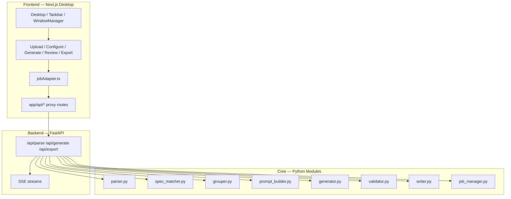

# TC Generator — 專案全覽

## 專案簡介

**TC Generator** 是一套針對 ASPICE SWE.6 的自動化測試案例產生工具。

目前專案由兩個主要面向組成：

- Python backend / CLI：負責解析、匹配、生成、驗證與 Excel 回寫
- Next.js desktop frontend：負責 upload -> configure -> generate -> review -> export 的操作流程

## 目前架構



## 目錄結構

```text
TC_Generator/
├── src/
│   ├── api_server.py
│   ├── parser.py
│   ├── spec_matcher.py
│   ├── spec_parser.py
│   ├── id_generator.py
│   ├── grouper.py
│   ├── prompt_builder.py
│   ├── generator.py
│   ├── validator.py
│   ├── writer.py
│   ├── job_manager.py
│   └── main.py
├── tests/
├── frontend/
│   ├── app/
│   │   ├── page.tsx
│   │   ├── layout.tsx
│   │   └── api/
│   │       ├── parse/route.ts
│   │       ├── group/route.ts
│   │       ├── match/route.ts
│   │       ├── generate/route.ts
│   │       ├── generate/stream/route.ts
│   │       ├── jobs/[jobId]/regenerate/stream/route.ts
│   │       ├── export/route.ts
│   │       └── export/download/[jobId]/route.ts
│   └── src/
│       ├── components/system/
│       ├── components/modules/
│       ├── services/jobAdapter.ts
│       ├── store/
│       ├── lib/
│       └── styles/
└── docs/
```

## 前端現況

### UI 方式

- 單頁桌面式介面，不使用多頁路由工作流
- Active modules 為 `*Module.tsx`
- 舊的 `*Window.tsx` 已移除

### 狀態與資料流

- `useJobStore`：工作資料、TC rows、config、logs、stats
- `useWindowStore`：視窗生命週期、位置、focus、minimize/maximize
- `jobAdapter.ts`：所有 active modules 共用的整合層
- `app/api/*`：同源 proxy，將瀏覽器請求轉給 Python backend

### 已驗證項目

- TypeScript typecheck 通過
- Python test suite 通過
- Parse proxy 端到端可用
- Configure 的 grouping / matching preview 已接到 backend
- Export proxy 與 workbook download 可用
- Generate / regenerate 的 proxy 與 stream 路徑可用
- 真正 AI 生成仍依賴有效的 `OPENAI_API_KEY`

## 後端現況

### 核心模組

- `parser.py`：解析 TC workbook
- `spec_matcher.py`：規格匹配
- `spec_parser.py`：補充文件解析
- `id_generator.py`：TC ID 生成
- `grouper.py`：Test Set grouping
- `prompt_builder.py`：prompt 組裝
- `generator.py`：OpenAI 呼叫與回應處理
- `validator.py`：程式化驗證
- `writer.py`：Excel 回寫
- `job_manager.py`：review/export 狀態管理
- `api_server.py`：前端整合 API

### API

- `GET /api/health`
- `POST /api/parse`
- `POST /api/group`
- `POST /api/match`
- `POST /api/generate`
- `GET /api/generate/stream`
- `POST /api/jobs/{jobId}/regenerate/stream`
- `POST /api/export`
- `GET /api/export/download/{jobId}`

## 不再保留在文件中的內容

下列內容不再放在本文件，因為它們變動太快或已經失真：

- 當前 git status / 未提交檔案列表
- 最近 commit 摘要
- 前端舊的 `usePythonAPI.ts` / `useSSE.ts` / `api-contract.ts` 架構
- `*Module.tsx + *Window.tsx` 並存的描述

## 下一步重點

目前最實際的後續工作是：

1. 用有效的 `ANTHROPIC_API_KEY` 跑一次真實 generate / regenerate / export 全流程
2. 用真實參考 workbook 驗證 Configure 的 grouping / matching preview 表現
3. 決定是否把 `specReference` 正式納入前端 row state，支撐後續手動 override
